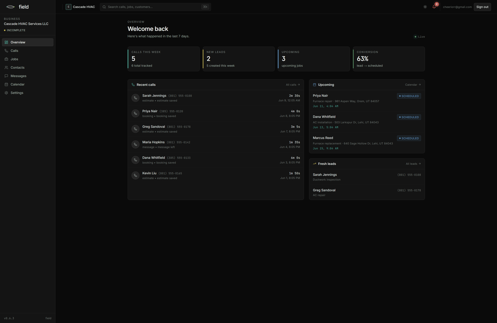
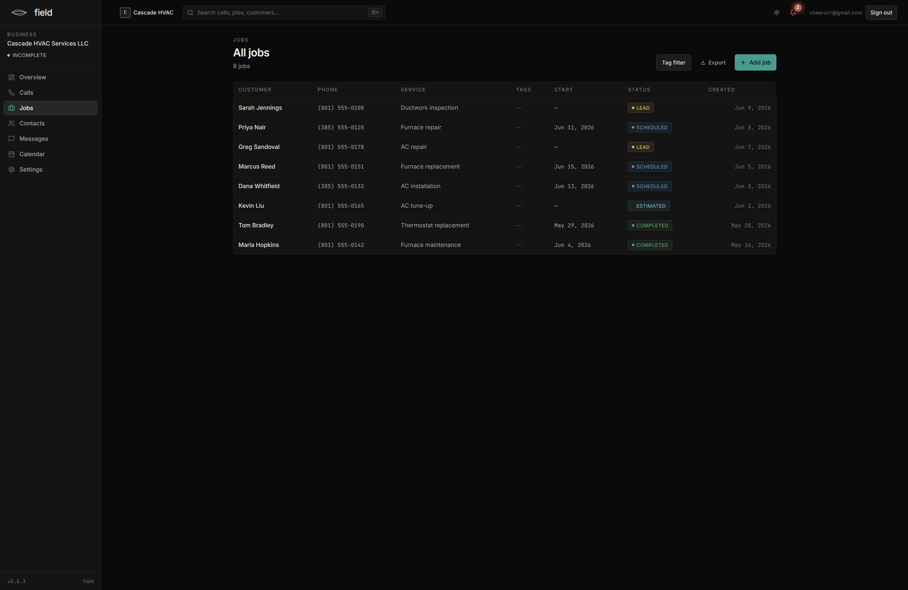
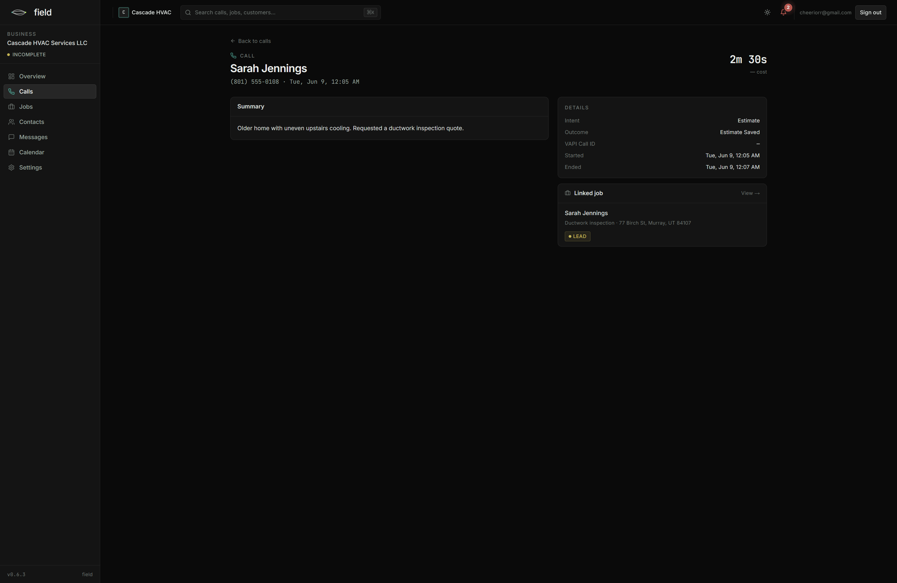
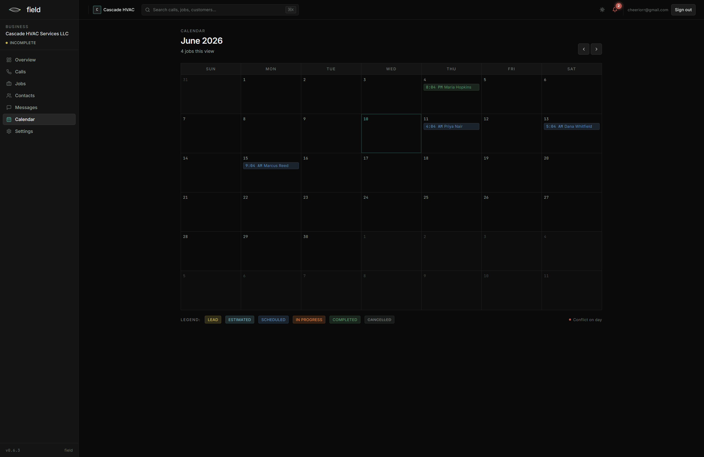

# Field: a multi-tenant dashboard and AI voice receptionist for service businesses

**Built by Dallin Theriault.** A multi-tenant SaaS for service businesses (HVAC, painting, and the like): an AI voice receptionist that answers calls, books jobs, and captures leads, with a per-tenant dashboard for jobs, contacts, calls, messages, and a calendar. Built under Field AI.

> **How this was built, read this first.** I am not a software engineer and I did not hand-write the code in this project. I architected and directed it. I made the technical decisions, designed the multi-tenant data model, scoped the work, communicated requirements to AI coding tools, debugged against real system logs, and ran a live cloud-to-local migration. The code itself was written by AI (Claude). I’m putting this up front because it’s the honest account of how the project was made, and because directing AI tools to a working, multi-tenant system is the actual skill this project demonstrates.

-----

## Screenshots

<table>
  <tr>
    <td width="50%"> <b>Overview</b> — calls this week, new leads, conversion, and a recent-calls feed.</td>
    <td width="50%"> <b>Jobs</b> — the pipeline with lead / scheduled / completed status.</td>
  </tr>
  <tr>
    <td width="50%"> <b>Call detail</b> — the AI summary, the detected intent and outcome, and the linked job.</td>
    <td width="50%"> <b>Calendar</b> — scheduled jobs across the month.</td>
  </tr>
</table>

-----

## Why I built it, and why I stopped

I set out to build a real product: an AI receptionist plus an intake and operations dashboard that small service businesses could actually run on. The voice agent answers the phone, figures out what the caller wants, books or schedules them, and drops the lead into a dashboard the owner can work from.

Then I spent enough time in the market to make a call I think was the right one: it’s saturated, and a lot of what’s out there is bad. I decided not to chase a crowded space with another me-too product. So I stopped at v0.6.3.

I’m keeping it here, finished to a working demo, for two reasons. It’s the clearest thing I’ve built to show how I think about backend architecture and real systems. And knowing when to stop building something is, honestly, part of the point. Shipping isn’t always the move. Sometimes the call is “this works, the market doesn’t, move on,” and making that call deliberately is worth more than grinding out a launch nobody needed.

## What it is

Field is **multi-tenant**. One system serves many client businesses, each with its own isolated data, its own branding, its own AI assistant, and its own settings. A platform admin can manage every tenant from one console; each tenant only ever sees its own data.

The backend that does the real work is a set of automation workflows (n8n) that handle the whole call lifecycle and write to a Postgres database (Supabase) with row-level security enforcing the tenant boundaries. The dashboard is the front end the business owner actually uses.

## What it actually does

These are the working features in the demo (v0.6.3):

- **AI voice receptionist.** A caller phones the business. The assistant answers, recognizes returning callers by their number, works out the intent (estimate, booking, question), and handles the call. It has escalation logic for when it needs to hand off, and it calls tools mid-call to look things up and save what it learns.
- **Calls to jobs, automatically.** When a call ends, the system writes a call summary, creates or updates the contact, and turns the lead into a job, no manual entry.
- **Jobs and pipeline.** Jobs across the full status range (lead, scheduled, completed), with service types, tags, addresses, and dates. Add, edit, filter, export.
- **Contacts.** Searchable customer list with tags, phone, email, and history.
- **Two-way messaging.** SMS conversations with customers, threaded per contact.
- **Calendar.** Real calendar integration: a booking creates an actual calendar event, and a cancellation removes it.
- **Post-call notifications.** The moment a call ends, the caller gets a confirmation and the business owner gets a real-time “new lead” ping.
- **Per-tenant configuration.** Each client’s assistant is driven by their own settings: business name, services, hours, pricing, escalation rules, callback promise, and feature toggles, all editable from the admin console and threaded into that tenant’s AI prompt.
- **Admin console.** A platform-wide view to manage every tenant’s backend from one place.

## How it’s built

- **AI voice agent** (VAPI) for the phone layer. It calls into the backend by webhook during and after each call.
- **Automation backend** (n8n, self-hosted): a hub workflow authenticates the call, resolves which tenant it belongs to, and routes to the right sub-workflow (estimate, booking, calendar, SMS, call-end). This is where the call lifecycle actually lives.
- **Postgres database** (Supabase) with **row-level security** enforcing tenant isolation: roughly 28 tables covering clients, users, jobs, contacts, calls, messages, calendar connections, notifications, billing scaffolding, audit logs, and per-tenant secrets.
- **Dashboard** (Next.js): the per-tenant front end and the platform admin console.
- **SMS** via Twilio, **email** via Resend, **calendar** via Google Calendar, **push notifications** via a self-hosted ntfy server.

## Two things from this project worth telling you about

I include these because the work that made me proud wasn’t the feature list, it was understanding the system well enough to find real problems and fix them properly.

### A cross-tenant security boundary, caught the right way

While making a demo tenant fully functional, I hit a bug that looked trivial and wasn’t. Toggling a feature flag for one tenant in the admin console wouldn’t save: flip it on, hit save, refresh, and it was off again. No error, just silently reset.

The cause was the security model working exactly as designed, against me. The save was going through the normal browser client, which is bound by row-level security to the admin’s *own* tenant. So when the admin tried to change a *different* tenant’s settings through that client, the database correctly refused, it updated zero rows, because row-level security wouldn’t let one tenant write another tenant’s data. The silent reset was RLS doing its job.

The fix was to route admin-level, cross-tenant writes through a separate privileged path with an explicit admin check, instead of the tenant-bound browser client. The lesson worth keeping: in a multi-tenant system, “it didn’t save and didn’t error” is often not a bug in your code, it’s your isolation model catching you doing something it was built to prevent. You have to respect the boundary, not work around it.

### Moving a live backend off the cloud without losing it

The entire call-handling backend, 17 workflows, originally ran on a hosted cloud automation service. I needed to move it to a self-hosted instance, and the hosted account was days from renewing, with a catch: cancelling would delete the whole workspace.

So the order mattered. First I backed up all 17 workflows to local files, which meant the system could survive cancellation no matter what. Then I rebuilt the core on the self-hosted instance and re-entered every credential by hand (credentials don’t export with the workflows). The real snag was that the hub workflow called its sub-workflows by ID, and a couple of platform quirks meant imported workflows needed their published version set before they’d activate at all. Once that was sorted, I verified the whole path end to end, including a real phone call that routed through the new local backend, recognized the caller, and wrote to the database, before cancelling anything on the old service.

The takeaway: when you’re moving something live, back up first so nothing’s at risk, then migrate, then verify against reality, and only then tear down the old thing. Never the other way around.

## How tenant isolation actually works

Worth calling out as a design decision, because it’s the spine of the whole thing. Every piece of data carries a tenant ID. Row-level security on the database enforces that a given tenant’s queries can only ever touch that tenant’s rows. The AI assistant for each client is configured entirely from that client’s own settings row, which gets threaded into the assistant’s prompt, so one shared system serves many businesses without their data or behavior bleeding into each other. The design is “one platform, many isolated tenants,” not “a separate copy per client.” That’s the part that would actually scale, and it’s the part I’m most deliberate about.

## Honest limitations

I’d rather be straight about what this is than oversell it.

- **It’s a demo, frozen at v0.6.3.** It’s a working showcase of the architecture and the core flow, not a launched, hardened product.
- **Billing is scaffolded, not finished.** The subscription and payment tables exist in the schema but the billing flow was deliberately left for later. It’s out of scope.
- **The demo tenant is seeded with realistic sample data.** The numbers and customers in the showcase are plausible demo data, not a real customer base.
- **Some pieces are wired for the demo, not for production scale.** For example, per-tenant phone numbers and the in-dashboard notification surface were intentionally deferred, the demo uses a notification stand-in to show the flow. I built the parts that prove the system works and stopped at the line where more work meant chasing a market I’d decided against.

## A note on how I work

I run AI coding tools the way a technical lead runs a team. I hold the roadmap, I keep each task small and specific, I tell it exactly what I need, I stop it from wandering into work that doesn’t serve the goal, and I check what comes back against what’s actually happening in the logs and the live system. The code was written by AI. Designing the multi-tenant architecture, deciding what to build and what to leave alone, running the migration, and verifying it all actually worked, that part was mine.

-----

*Personal project, built under Field AI. Not affiliated with any employer. Built by Dallin Theriault.*
